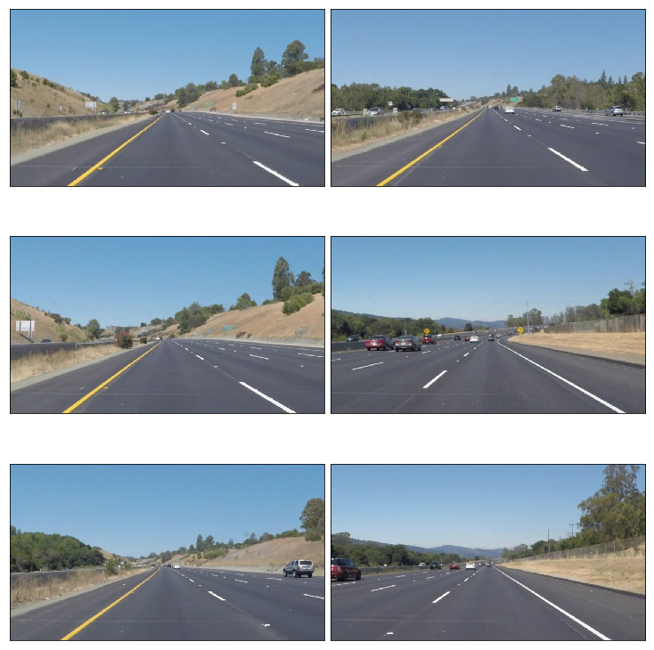
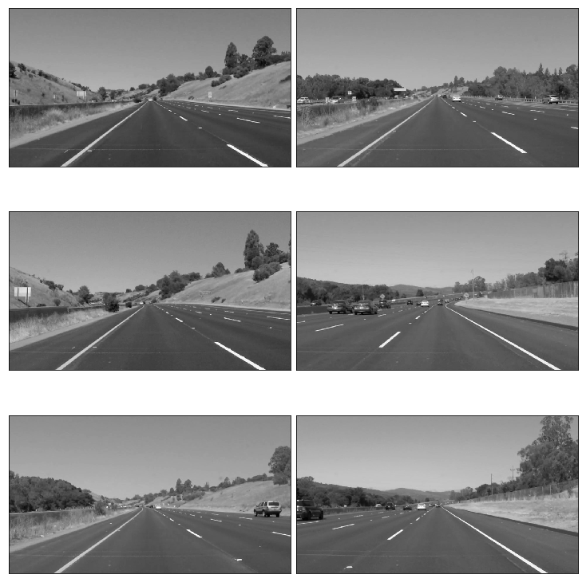
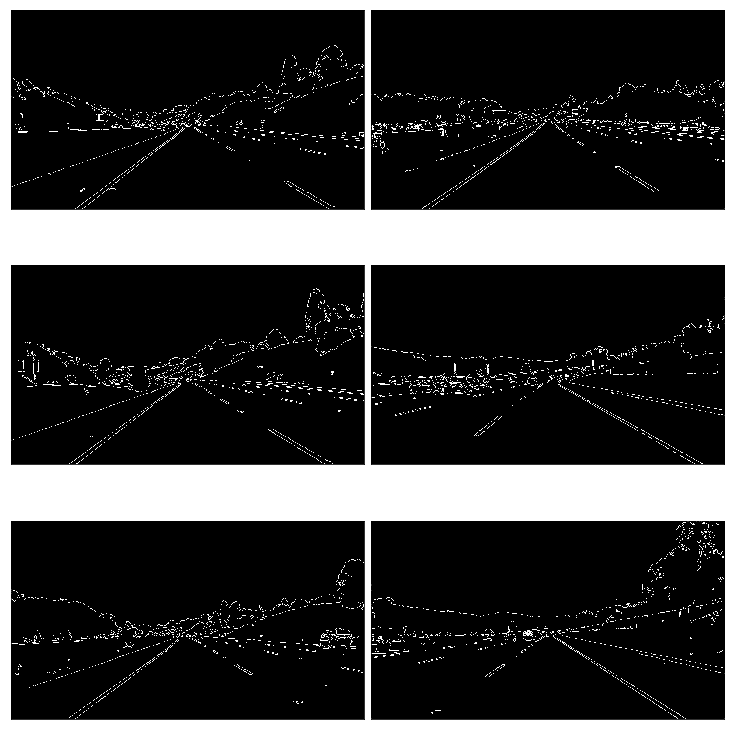
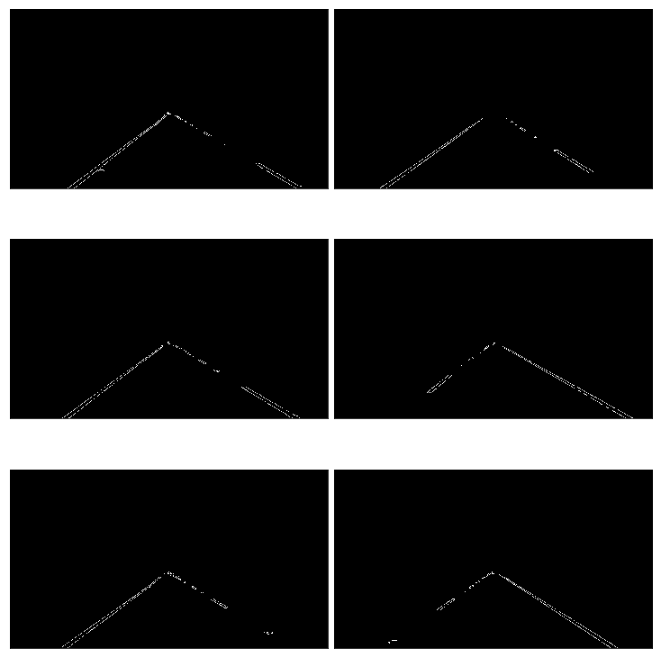
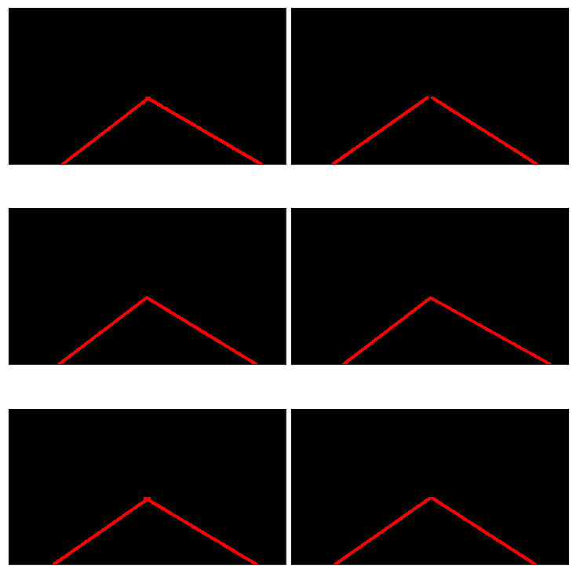
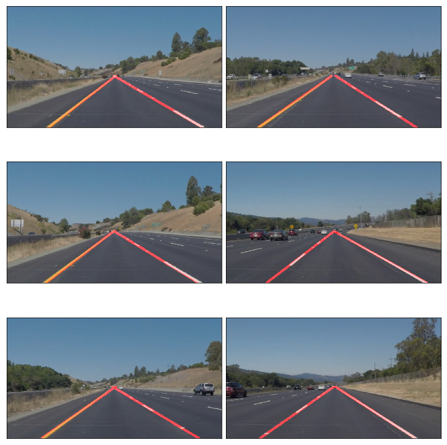
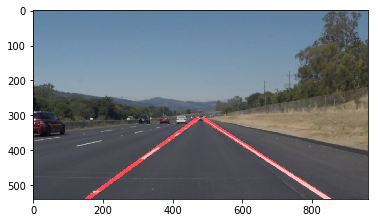

# Lane Detection - Project 1
Project requirements:
    1. Reliable Lane Detection
    2. Solid/Broken White/Yellow lane detection
   
Approach:
    1. Read the images. 
    2. Conver to grayscale format.
    3. Apply Gaussian filter to remove noise.
    4. Apply Canny filter to detect images. 
    5. Create Region of Interest
    6. Detect the Hough lines
            
# Import Packages

```python
#importing some useful packages
import matplotlib.pyplot as plt
import matplotlib.image as mpimg
import numpy as np
import cv2
%matplotlib inline
```
# Read an Image
```python
#reading in an image
image = mpimg.imread('test_images/solidWhiteRight.jpg')

#printing out some stats and plotting
print('This image is:', type(image), 'with dimensions:', image.shape)
plt.imshow(image)  # if you wanted to show a single color channel image called 'gray', for example, call as plt.imshow(gray, cmap='gray')
plot_images(test_images)
```


# Helper Functions 
```python
import math

def grayscale(img):
    """Applies the Grayscale transform
    This will return an image with only one color channel
    but NOTE: to see the returned image as grayscale
    (assuming your grayscaled image is called 'gray')
    you should call plt.imshow(gray, cmap='gray')"""
    return cv2.cvtColor(img, cv2.COLOR_RGB2GRAY)
    # Or use BGR2GRAY if you read an image with cv2.imread()
    # return cv2.cvtColor(img, cv2.COLOR_BGR2GRAY)
    
def canny(img, low_threshold, high_threshold):
    """Applies the Canny transform"""
    return cv2.Canny(img, low_threshold, high_threshold)

def gaussian_blur(img, kernel_size):
    """Applies a Gaussian Noise kernel"""
    return cv2.GaussianBlur(img, (kernel_size, kernel_size), 0)

def region_of_interest(img, vertices):
    """
    Applies an image mask.
    
    Only keeps the region of the image defined by the polygon
    formed from `vertices`. The rest of the image is set to black.
    `vertices` should be a numpy array of integer points.
    """
    #defining a blank mask to start with
    mask = np.zeros_like(img)   
    
    #defining a 3 channel or 1 channel color to fill the mask with depending on the input image
    if len(img.shape) > 2:
        channel_count = img.shape[2]  # i.e. 3 or 4 depending on your image
        ignore_mask_color = (255,) * channel_count
    else:
        ignore_mask_color = 255
        
    #filling pixels inside the polygon defined by "vertices" with the fill color    
    cv2.fillPoly(mask, vertices, ignore_mask_color)
    
    #returning the image only where mask pixels are nonzero
    masked_image = cv2.bitwise_and(img, mask)
    return masked_image


def draw_lines(img, lines, color=[255, 0, 0], thickness=10):
    """
    NOTE: this is the function you might want to use as a starting point once you want to 
    average/extrapolate the line segments you detect to map out the full
    extent of the lane (going from the result shown in raw-lines-example.mp4
    to that shown in P1_example.mp4).  
    
    Think about things like separating line segments by their 
    slope ((y2-y1)/(x2-x1)) to decide which segments are part of the left
    line vs. the right line.  Then, you can average the position of each of 
    the lines and extrapolate to the top and bottom of the lane.
    
    This function draws `lines` with `color` and `thickness`.    
    Lines are drawn on the image inplace (mutates the image).
    If you want to make the lines semi-transparent, think about combining
    this function with the weighted_img() function below
    """
    for line in lines:
        for x1,y1,x2,y2 in line:
            cv2.line(img, (x1, y1), (x2, y2), color, thickness)

            
def get_point(mn,md,x,y,y1):
    m = md / mn
    c = y - ( m * x )
    x =(y1-c)/m
    return x

def draw_lines_extended(img, lines, color=[255, 0, 0], thickness=10):
    left_lines    = [] # (slope, intercept)
    right_lines   = [] # (slope, intercept)
    
    for line in lines:
        for x1,y1,x2,y2 in line:
            #cv2.line(img, (x1, y1), (x2, y2), color, thickness)
            if x2==x1:
                continue # ignore a vertical line
            slope = float((y2-y1)/(x2-x1))
            if slope > 0:
                left_lines.append([x1,y1])
                left_lines.append([x2,y2])
            else:
                right_lines.append([x1,y1])
                right_lines.append([x2,y2])
    
    [mn1,md1,x3,y3] = cv2.fitLine(np.array(left_lines, dtype=np.int32), cv2.DIST_L2,0,0.01,0.01)
    [mn2,md2,x4,y4] = cv2.fitLine(np.array(right_lines, dtype=np.int32), cv2.DIST_L2,0,0.01,0.01)
    left_x_d=int(get_point(mn1,md1,x3,y3,540))
    left_x_t=int(get_point(mn1,md1,x3,y3,310))
    
    right_x_d=int(get_point(mn2,md2,x4,y4,540))
    right_x_t=int(get_point(mn2,md2,x4,y4,310))
    cv2.line(img, (left_x_t, 310), (left_x_d, 540), color, thickness)
    cv2.line(img, (right_x_t, 310), (right_x_d, 540), color, thickness)
    
    
def hough_lines(img, rho, theta, threshold, min_line_len, max_line_gap):
    """
    `img` should be the output of a Canny transform.
        
    Returns an image with hough lines drawn.
    """
    lines = cv2.HoughLinesP(img, rho, theta, threshold, np.array([]), minLineLength=min_line_len, maxLineGap=max_line_gap)
    line_img = np.zeros((img.shape[0], img.shape[1], 3), dtype=np.uint8)
    draw_lines_extended(line_img, lines)
    return line_img

# Python 3 has support for cool math symbols.

def weighted_img(img, initial_img, α=0.8, β=1., γ=0.):
    """
    `img` is the output of the hough_lines(), An image with lines drawn on it.
    Should be a blank image (all black) with lines drawn on it.
    
    `initial_img` should be the image before any processing.
    
    The result image is computed as follows:
    
    initial_img * α + img * β + γ
    NOTE: initial_img and img must be the same shape!
    """
    return cv2.addWeighted(initial_img, α, img, β, γ)
```

# Test Images

```python
import os
os.listdir("test_images/")
```
# Read image and plot function

```python
import glob
def plot_images(images, cmap=None):
    cols = 2
    rows = (len(images)+1)//cols
    
    plt.figure(figsize=(10, 11))
    for i, image in enumerate(images):
        plt.subplot(rows, cols, i+1)
        # use gray scale color map if there is only one channel
        cmap = 'gray' if len(image.shape)==2 else cmap
        plt.imshow(image, cmap=cmap)
        plt.xticks([])
        plt.yticks([])
    plt.tight_layout(pad=0, h_pad=0, w_pad=0)
    plt.show()
    
test_images = [plt.imread(path) for path in glob.glob('test_images/*.jpg')]

plot_images(test_images)
```



# Build a Lane Finding Pipeline
The pipeline consisted of 5 steps. First, I converted the images to grayscale, then detect the edges using canny filter. Then decide the area of interest and the hough line in the are of interest. Then draw the line on the original image. After detecting the line extrapolate the lines. For getting a straight line cv2.fitLine is used which gives an approximate a straight line to the hough lines. Then the slope of line is found with the points on the line and extrapolated on both sides with and y value is obtained.

# Read image and convert to grayscale

```python
gray_list=(list(map(grayscale, test_images)))
plot_images(gray_list)
```




# Gaussian fliter

```python
gaussian_blur_list=(list(map(lambda image:gaussian_blur(image,3), gray_list)))
plot_images(gaussian_blur_list)
```

# Canny filter
To detect the edges
```python
edges_list=(list(map(lambda blur:canny(blur,50,150), gaussian_blur_list)))
plot_images(edges_list)
```


# Region of interest
```python
imshape = image.shape
vertices = np.array([[(120,imshape[0]),(475, 310), (480, 310), (imshape[1],imshape[0])]], dtype=np.int32)
masked_image_list=(list(map(lambda edges:region_of_interest(edges,vertices), edges_list)))
plot_images(masked_image_list)
```


# Hough Lines
Hough Lines takes the image in xy space and convert them into ro,theta space. Which actually makes it simple to detect Lines as points in ro,theta space. By thresholding it, we can define the length of the lines. 

Parameters that can be tweaked in this transform:

    1.rho – Distance resolution of the accumulator in pixels.
    2.theta – Angle resolution of the accumulator in radians.
    3.threshold – Accumulator threshold parameter. Only those lines are returned that get enough votes (> threshold).
    4.minLineLength – Minimum line length. Line segments shorter than that are rejected.
    5.maxLineGap – Maximum allowed gap between points on the same line to link them. (Clustering a group of lines with certain gap)

```python
lines_list=(list(map(lambda masked_image:hough_lines(masked_image,2,3*np.pi/180,20,20,200), masked_image_list)))
plot_images(lines_list)
```



# Create a "color" binary image to combine with line image
```python
color_edges_list=(list(map(lambda edges: np.dstack((edges, edges, edges)), edges_list)))
plot_images(color_edges_list)
```

# Draw the lines on the edge image
```python
weighted_img_list=(list(map(lambda lines,image: weighted_img(lines,image), lines_list,test_images)))
plot_images(weighted_img_list)
```


# Process Image
The Lines look good on Test Images. Lets write a single function which computes all the above in sequence.
```python
def process_image(image):
    # NOTE: The output you return should be a color image (3 channel) for processing video below
    # TODO: put your pipeline here,
    # you should return the final output (image where lines are drawn on lanes)
    gray=grayscale(image)
    blur=gaussian_blur(gray,3)
    edges=canny(blur,40,160)
    
    imshape = image.shape
    vertices = np.array([[(120,imshape[0]),(475, 300), (480, 300), (875,imshape[0])]], dtype=np.int32)
    
    masked_image =region_of_interest(edges,vertices)
    lines=hough_lines(masked_image,2,3*np.pi/180,20,20,200)
    color_edges = np.dstack((edges, edges, edges))
    lines_edges=weighted_img(lines,image)
    
    return lines_edges
```

    <matplotlib.image.AxesImage at 0x11724b550>




# Test on Videos


```python
white_output = 'test_videos_output/solidWhiteRight.mp4'
## To speed up the testing process you may want to try your pipeline on a shorter subclip of the video
## To do so add .subclip(start_second,end_second) to the end of the line below
## Where start_second and end_second are integer values representing the start and end of the subclip
## You may also uncomment the following line for a subclip of the first 5 seconds
##clip1 = VideoFileClip("test_videos/solidWhiteRight.mp4").subclip(0,5)
clip1 = VideoFileClip("test_videos/solidWhiteRight.mp4")
white_clip = clip1.fl_image(process_image) #NOTE: this function expects color images!!
%time white_clip.write_videofile(white_output, audio=False)
```


    [MoviePy] >>>> Building video test_videos_output/solidWhiteRight.mp4
    [MoviePy] Writing video test_videos_output/solidWhiteRight.mp4
    100%|█████████▉| 221/222 [00:12<00:00, 16.64it/s]
    [MoviePy] Done.
    [MoviePy] >>>> Video ready: test_videos_output/solidWhiteRight.mp4 

    CPU times: user 2.06 s, sys: 174 ms, total: 2.24 s
    Wall time: 13.8 s

```python
yellow_output = 'test_videos_output/solidYellowLeft.mp4'
## To speed up the testing process you may want to try your pipeline on a shorter subclip of the video
## To do so add .subclip(start_second,end_second) to the end of the line below
## Where start_second and end_second are integer values representing the start and end of the subclip
## You may also uncomment the following line for a subclip of the first 5 seconds
##clip2 = VideoFileClip('test_videos/solidYellowLeft.mp4').subclip(0,5)
clip2 = VideoFileClip('test_videos/solidYellowLeft.mp4')
yellow_clip = clip2.fl_image(process_image)
%time yellow_clip.write_videofile(yellow_output, audio=False)
```
    [MoviePy] >>>> Building video test_videos_output/solidYellowLeft.mp4
    [MoviePy] Writing video test_videos_output/solidYellowLeft.mp4
    100%|█████████▉| 681/682 [00:41<00:00, 16.38it/s]
    [MoviePy] Done.
    [MoviePy] >>>> Video ready: test_videos_output/solidYellowLeft.mp4 

    CPU times: user 6.57 s, sys: 585 ms, total: 7.16 s
    Wall time: 43.4 s

The code seems to work well for the sample videos and test images.

# Short Comings
    1. It may not work well if there is a curved road.
    2. It may not work if there is snow on the road.
    3. During fog and rain we may not be able to detect the lines from a foggy image
    

# Possible Improvements
    1. Detect the lanes on curved road.
    2. Must be able to differentiate White and Yellow.
